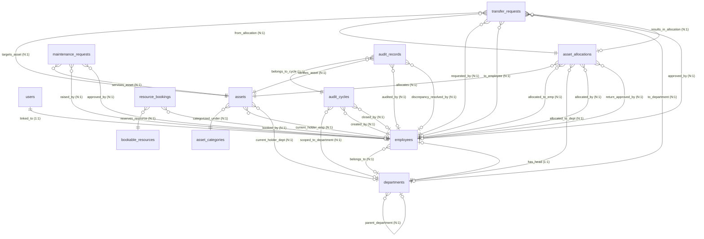

# AssetFlow

AssetFlow is a modern, enterprise-grade Asset and Resource Management System designed to handle corporate hardware, software, licenses, and shared resources.

Developed by Jayavighnesh B K for Odoo Hackathon 2026

This repository is split into:
* **[backend](file:///D:/odoo/backend)**: Express + TypeScript + PostgreSQL API using TypeORM.
* **[frontend](file:///D:/odoo/frontend)**: Vite + React + Radix UI + Tailwind CSS v4 client dashboard.

---

## 🗄️ Database Design Architecture

AssetFlow uses **PostgreSQL** as its relational database management system, managed via the **TypeORM** Object-Relational Mapper. The design focuses on strong referential integrity, clear organizational hierarchies, comprehensive audit trails, and a dynamic schema-less custom field mechanism using PostgreSQL's binary JSON format (`JSONB`).

### 1. Entity-Relationship Diagram (ERD)

---

### 2. Core Tables Schema Details

#### `users`
Stores credentials, login tracking, and password resets.
* **`id`** (`uuid`, PK): Primary identifier.
* **`email`** (`varchar`, Unique Index): User email address.
* **`password_hash`** (`varchar`): Salted bcrypt password hash.
* **`password_reset_token`** (`text`, Nullable): Verification token for password recovery.
* **`password_reset_expires_at`** (`timestamptz`, Nullable): Recovery window expiration.
* **`is_active`** (`boolean`, Default `true`): Controls login authorization.
* **`last_login_at`** (`timestamptz`, Nullable): Audit column for user activity.

#### `employees`
Contains employee profiles, roles, and hierarchy links.
* **`id`** (`uuid`, PK): Primary identifier.
* **`employee_code`** (`varchar`, Unique Index): Automatic code sequence (`EMP-0001`).
* **`name`** (`varchar`): Employee full name.
* **`user_id`** (`uuid`, FK, 1:1 users): Links to the user login account.
* **`department_id`** (`uuid`, FK, Many:1 departments): Organization assignment.
* **`role`** (`enum`): `employee`, `department_head`, `asset_manager`, or `admin`.
* **`is_active`** (`boolean`, Default `true`): Signifies active employment status.

#### `departments`
Supports organizational structures, child departments, and managers.
* **`id`** (`uuid`, PK): Primary identifier.
* **`name`** (`varchar`, Unique): Department name.
* **`code`** (`varchar`, Unique): Department code (e.g., `HR`, `IT`).
* **`department_head_id`** (`uuid`, FK, Many:1 employees): Reference to the manager.
* **`parent_department_id`** (`uuid`, FK, Many:1 departments): Supports nested sub-departments.
* **`status`** (`enum`): `active` or `inactive`.

#### `asset_categories`
Defines asset categorization schemas.
* **`id`** (`uuid`, PK): Primary identifier.
* **`name`** (`varchar`, Unique): Category name (e.g., `Laptops`, `Vehicles`).
* **`description`** (`text`, Nullable): Description of category scopes.
* **`custom_field_schema`** (`jsonb`): Defines dynamic attributes. (Example: `[{"key": "RAM", "type": "string"}, {"key": "Storage", "type": "number"}]`).

#### `assets`
The core repository of trackable corporate resources.
* **`id`** (`uuid`, PK): Primary identifier.
* **`asset_tag`** (`varchar`, Unique Index): Auto-generated sequential ID (`AF-0001`).
* **`name`** (`varchar`): Asset name.
* **`category_id`** (`uuid`, FK, Many:1 asset_categories): Links to classification.
* **`serial_number`** (`text`, Nullable): OEM serial number.
* **`acquisition_date`** (`date`, Nullable): Purchase date.
* **`acquisition_cost`** (`decimal(12,2)`, Nullable): Financial valuation.
* **`condition`** (`text`, Nullable): Condition details (e.g., `New`, `Good`, `Damaged`).
* **`location`** (`text`, Nullable): Physical room, desk, or site.
* **`category_specific_fields`** (`jsonb`): Stores key-value values adhering to the category's `custom_field_schema`.
* **`status`** (`enum`): `available`, `allocated`, `reserved`, `under_maintenance`, `lost`, `retired`, `disposed`.
* **`current_holder_employee_id`** (`uuid`, FK, Many:1 employees): Person holding the asset.
* **`current_holder_department_id`** (`uuid`, FK, Many:1 departments): Department holding the asset.

#### `asset_allocations`
Records physical custody cycles of assets.
* **`id`** (`uuid`, PK): Primary identifier.
* **`asset_id`** (`uuid`, FK, Many:1 assets): Target asset.
* **`allocated_to_employee_id`** (`uuid`, FK): Assigned employee holder.
* **`allocated_to_department_id`** (`uuid`, FK): Assigned department holder.
* **`allocated_date`** (`timestamptz`): Allocation start timestamp.
* **`expected_return_date`** (`timestamptz`, Nullable): Due date.
* **`status`** (`enum`): `active`, `returned`, `transferred`, `return_requested`.
* **`allocated_by_employee_id`** (`uuid`, FK): Admin/Manager who approved.

#### `transfer_requests`
Manages approval workflows when assets change hands.
* **`id`** (`uuid`, PK): Primary identifier.
* **`asset_id`** (`uuid`, FK): Target asset.
* **`current_allocation_id`** (`uuid`, FK): Source allocation reference.
* **`requested_by_employee_id`** (`uuid`, FK): Requester.
* **`requested_to_employee_id`** (`uuid`, FK): Intended recipient.
* **`requested_to_department_id`** (`uuid`, FK): Intended department recipient.
* **`status`** (`enum`): `requested`, `approved`, `rejected`, `completed`.
* **`reason`** (`text`, Nullable): Request reason.

#### `maintenance_requests`
Services tickets, technician scheduling, and downtime/cost analytics.
* **`id`** (`uuid`, PK): Primary identifier.
* **`asset_id`** (`uuid`, FK): Affected asset.
* **`raised_by_employee_id`** (`uuid`, FK): Employee reporting the issue.
* **`issue_description`** (`text`): Description of fault.
* **`priority`** (`enum`): `low`, `medium`, `high`, `critical`.
* **`status`** (`enum`): `pending`, `approved`, `rejected`, `technician_assigned`, `in_progress`, `resolved`.
* **`cost`** (`numeric(10,2)`): Repair costs.
* **`actual_downtime`** (`integer`, Nullable): Cumulative hours out of service.

#### `audit_cycles` & `audit_records`
Handles inventory audits.
* **`audit_cycles`**: Tracks the audit timeline scoped to locations or departments.
* **`audit_records`**: Captures verification details (`verified`, `missing`, `damaged`) and flags system discrepancies (`is_discrepancy`).

#### `bookable_resources` & `resource_bookings`
Handles bookings for shared enterprise resources (projectors, vehicles, meeting rooms) that can be reserved by employees.

---
